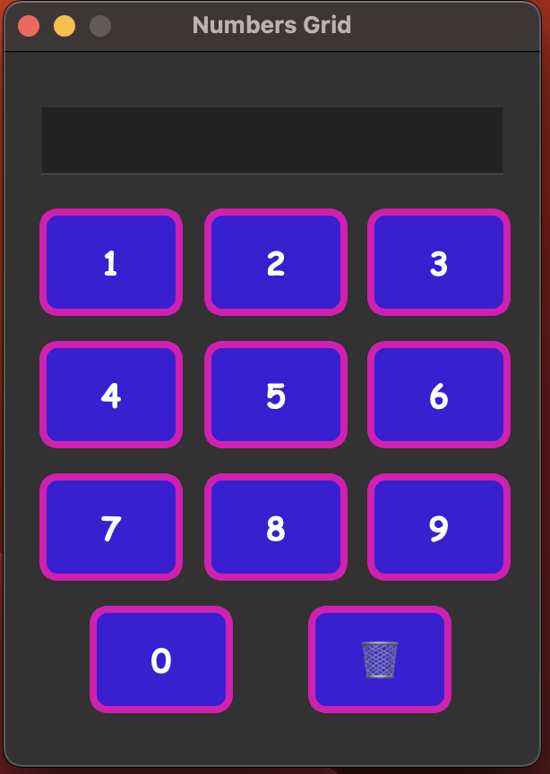

# 🔢 NumberPad

This is a simple, stylish number pad GUI built with **PySide6** Framework in **Python**. It features clickable number buttons (0-9) and a 🗑️ delete button, with a display area that shows the numbers as they are clicked.

Perfect for beginners learning PySide6 and how to use layouts, buttons, signals, and custom styles!

---

## 🎯 Features

- Beautifully styled number buttons using QSS (Qt Style Sheets)
- A display area using `QLineEdit` to show clicked input
- A 🗑️ button to delete the last character (backspace)
- Layout management using `QVBoxLayout`, `QGridLayout`, and `QHBoxLayout`
- All button clicks handled with a reusable lambda function

---

## 📸 Screenshot



---

## 🛠️ Installation Instructions

### 1. Install Python 🐍  
If you don’t already have Python installed, download and install it from the official website:  
👉 [Download Python](https://www.python.org/downloads/)

> ✅ Make sure to check the option **“Add Python to PATH”** during installation (on Windows)!

---

### 2. Install PySide6 (Python Framework) via pip

Once Python is installed, open your terminal or command prompt and run:

```bash
pip install PySide6
